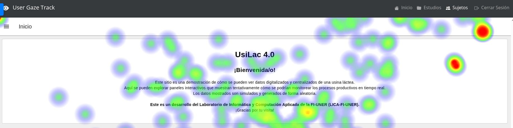

<h1 align="center">
👁️ RemoteGazeUX
</h1>

<div align="center">
    
</div>

<h2 align="center">
Professional Eye-Tracking Research, No Lab Required 🚀
</h2>

<h3 align="center">
Run remote usability studies with webcam-based eye and mouse tracking
</h3>

<div align="center">


</div>

<div align="center">
    <h3>
        <a href="#-quick-start">Quick Start</a> •
        <a href="#-key-features">Features</a> •
        <a href="#-documentation">Documentation</a> •
        <a href="#-showcase">Showcase</a> •
        <a href="#-contributing">Contributing</a>
    </h3>
</div>

---

## 🎯 What is RemoteGazeUX?

**RemoteGazeUX** transforms UX research by bringing professional eye-tracking to your browser. No expensive hardware, no lab setup, no installation for participants.

**Perfect for:**
- 🎨 **UX Researchers** - Validate designs with real gaze data
- 📊 **Product Teams** - Make data-driven interface decisions  
- 🎓 **Academic Researchers** - Conduct rigorous HCI studies
- 🏢 **Design Agencies** - Wow clients with eye-tracking insights

### Why RemoteGazeUX?

| Traditional Eye-Tracking | RemoteGazeUX |
|-------------------------|--------------|
| $10,000+ hardware 💰 | Free & open-source ✅ |
| Lab required 🏢 | Works anywhere 🌍 |
| Participants travel to you 🚗 | Test users globally 🌐 |
| Complex setup 🔧 | 5-minute installation ⚡ |
| Proprietary software 🔒 | Open source & customizable 🔓 |

## ✨ Key Features

### 👁️ **Webcam Eye-Tracking**
- Powered by [WebGazer.js](https://webgazer.cs.brown.edu/) - research-grade accuracy
- Automatic calibration process
- 60 Hz data collection
- Works with any webcam

### 🖱️ **Mouse Tracking**
- Complete interaction tracking
- Click detection and heatmaps
- Scroll behavior monitoring
- Element-level analytics

### 🎨 **Flexible Testing**
- **Figma** prototypes
- **Static images** (PNG, JPG, SVG)
- **Live websites**
- **Custom HTML**

### 📊 **Beautiful Visualizations**
- 🔥 **Heatmaps** - See attention patterns
- 👁️ **Gaze plots** - Follow eye movements  
- 🖱️ **Click maps** - Track interactions
- 📈 **Analytics** - Quantitative metrics

### 🚀 **Easy Remote Testing**
- Share a simple link
- No installation for participants
- Works on Windows, Mac, Linux
- Automatic data storage

### 📥 **Professional Exports**
- CSV data for analysis (R, Python, SPSS)
- Publication-ready visualizations
- Batch downloads
- Complete metadata

## 🚀 Quick Start

Get up and running in **less than 5 minutes**:

### 1. Clone the Repository

```bash
git clone https://github.com/justogm/RemoteGazeUX.git
cd RemoteGazeUX
```

### 2. Run It!

```bash
python run.py
```

That's it! 🎉 The script will:
- ✅ Install all dependencies automatically
- ✅ Set up the database
- ✅ Walk you through initial configuration
- ✅ Start the web server

### 3. Access the Application

Open your browser and navigate to:
- **Participant entry:** `http://localhost:5000`
- **Admin dashboard:** `http://localhost:5000/sujetos`

> 💡 **First-time setup:** You'll be prompted to create an admin account and configure your first study.

## 📖 Documentation

Comprehensive documentation is available:

- **[Getting Started Guide](docs/docs/getting_started/installation.md)** - Installation and setup
- **[Quick Start Tutorial](docs/docs/getting_started/quickstart.md)** - Your first study in 10 minutes
- **[Configuration Guide](docs/docs/getting_started/configuration.md)** - Customize everything
- **[Features Overview](docs/docs/getting_started/overview.md)** - All features explained
- **[API Reference](docs/docs/api_reference/)** - For developers

## 🎬 How It Works

### For Participants (Simple!)

1. **Click a link** - No installation needed
2. **Fill a short form** - Basic demographics
3. **Calibrate webcam** - 2-minute process
4. **Complete tasks** - Interact naturally with your prototype
5. **Done!** - Data automatically saved

### For Researchers (Powerful!)

1. **Configure study** - Set up tasks and prototype
2. **Share link** - Invite participants
3. **Collect data** - Automatic tracking and storage
4. **Analyze results** - Beautiful heatmaps and exports
5. **Make decisions** - Data-driven UX improvements

## 💡 Use Cases

### 🎨 **Usability Testing**
Test interface designs and find usability issues
```
Finding: 80% of users missed the CTA button
Action: Increased button size and contrast
Result: 95% now find it within 3 seconds ✅
```

### 📊 **A/B Testing**
Compare design variants objectively
```
Design A: 45% noticed the feature
Design B: 78% noticed the feature
Winner: Design B → Deployed! 🚀
```

### 🎓 **Academic Research**
Conduct rigorous HCI studies
```
Published 2 papers using RemoteGazeUX data
Testing 150+ participants remotely
Reproducible methodology ✅
```

### 🏢 **Client Presentations**
Show clients exactly what users see
```
Client: "Why didn't users click the banner?"
You: *Shows heatmap* "They never looked at it."
Client: "Oh! Let's redesign." 💡
```

## 🌟 Showcase

### Data Entry Form
<div align="center">
    
    <p><i>Clean, professional participant registration</i></p>
</div>

### Calibration Process
<div align="center">
    
    <p><i>Simple 9-point calibration with visual feedback</i></p>
</div>

### Participant Dashboard
<div align="center">
    
    <p><i>Manage all participants and studies in one place</i></p>
</div>

### Results & Heatmaps
<div align="center">
    <p><i>Beautiful, publication-ready visualizations</i></p>
</div>

## 🔧 Configuration

Customize everything with the built-in GUI:

```bash
python src/config.py
```

Or edit JSON files directly:

```json
{
  "study_name": "My UX Study",
  "prototype_url": "https://www.figma.com/proto/...",
  "enable_gaze_tracking": true,
  "enable_mouse_tracking": true,
  "calibration_points": 9
}
```

### What You Can Configure

- ✅ Study settings and tasks
- ✅ Participant form fields
- ✅ Calibration parameters
- ✅ Visual appearance (colors, logo)
- ✅ Data privacy settings
- ✅ Export formats
- ✅ And much more!

## 🔐 Security & Privacy

> [!CAUTION]
> **Development Software:** RemoteGazeUX is designed for controlled research environments. Apply proper security measures before using in production.

**Current security features:**
- ✅ Password-protected admin routes
- ✅ Self-hosted (your data stays yours)
- ✅ HTTPS support (SSL certificates included)
- ✅ Participant anonymization options
- ✅ GDPR-compliant data handling

**Before production use:**
- 🔒 Change default SSL certificates
- 🔒 Use strong passwords
- 🔒 Secure database file
- 🔒 Review data privacy settings
- 🔒 Implement additional access controls

## 🛠️ Tech Stack

Built with proven, reliable technologies:

- **[Flask](https://flask.palletsprojects.com/)** - Python web framework
- **[WebGazer.js](https://webgazer.cs.brown.edu/)** - Eye-tracking (cited in 1000+ papers)
- **[heatmap.js](https://www.patrick-wied.at/static/heatmapjs/)** - Heatmap visualization
- **[SQLite](https://www.sqlite.org/)** - Database (upgradable to PostgreSQL/MySQL)
- **[Bootstrap](https://getbootstrap.com/)** - Responsive UI

## 🤝 Contributing

We welcome contributions! Here's how to help:

### Quick Contribution Guide

1. **Fork** the repository
2. **Create a branch** (`git checkout -b feature/amazing-feature`)
3. **Make your changes**
4. **Test** thoroughly
5. **Commit** (`git commit -m 'Add amazing feature'`)
6. **Push** (`git push origin feature/amazing-feature`)
7. **Open a Pull Request**

### Contribution Ideas

- 🐛 **Bug fixes** - Found an issue? Fix it!
- ✨ **New features** - Mobile support, new visualizations, etc.
- 📖 **Documentation** - Improve guides and examples
- 🌍 **Translations** - Help make RemoteGazeUX multilingual
- 🎨 **Designs** - Better UI/UX
- 🧪 **Tests** - Increase code coverage

### Guidelines

- Keep changes focused and small
- Add/update tests for your changes
- Update documentation
- Follow existing code style
- Be respectful and constructive

**For major changes, open an issue first to discuss!**

## 🗺️ Roadmap

Exciting features coming soon:

- [ ] 🎥 **Screen Recording** - Video replay of sessions
- [ ] 📱 **Mobile Support** - Eye tracking on tablets
- [ ] 🤖 **AI Analysis** - Automated UX insights
- [ ] 📊 **Advanced Analytics** - Built-in statistical tests
- [ ] ☁️ **Cloud Hosting** - Managed RemoteGazeUX service
- [ ] 🔌 **Integrations** - Slack, Jira, Trello webhooks
- [ ] 🌐 **Multi-language** - Interface in 10+ languages
- [ ] 📧 **Email Reports** - Automated study summaries

**Vote for features or suggest new ones in [Issues](https://github.com/justogm/RemoteGazeUX/issues)!**

## 📚 Citation

If RemoteGazeUX helps your research, please cite the WebGazer.js foundation:

```bibtex
@inproceedings{papoutsaki2016webgazer,
  title={WebGazer: Scalable Webcam Eye Tracking Using User Interactions},
  author={Papoutsaki, Alexandra and Sangkloy, Patsorn and Laskey, James and Daskalova, Nediyana and Huang, Jeff and Hays, James},
  booktitle={Proceedings of the 25th International Joint Conference on Artificial Intelligence (IJCAI)},
  pages={3839--3845},
  year={2016},
  organization={AAAI}
}
```

## 📧 Contact & Support

### Get Help

- 📖 **Documentation:** [Read the docs](docs/)
- 🐛 **Bug reports:** [Open an issue](https://github.com/justogm/RemoteGazeUX/issues)
- 💬 **Questions:** [Discussions](https://github.com/justogm/RemoteGazeUX/discussions)
- 📧 **Email:** [justo.garcia@ingenieria.uner.edu.ar](mailto:justo.garcia@ingenieria.uner.edu.ar)

### Maintainer

**Justo Garcia**  
Main Developer & Maintainer  
📧 [justo.garcia@ingenieria.uner.edu.ar](mailto:justo.garcia@ingenieria.uner.edu.ar)  
🐙 [@justogm](https://github.com/justogm)

## 🌟 Show Your Support

If RemoteGazeUX helps your research or work:

- ⭐ **Star this repo** - Helps others discover it
- 🐦 **Tweet about it** - Spread the word
- 📝 **Write a blog post** - Share your experience
- 💬 **Tell colleagues** - Help fellow researchers
- 🤝 **Contribute** - Make it even better

## 👥 Contributors

Thank you to all our contributors! 

<a href="https://github.com/justogm/RemoteGazeUX/graphs/contributors">
  
</a>

## 📄 License

RemoteGazeUX is open-source software licensed under the **GPL-3.0 License**.

See [LICENSE](LICENSE) for details.

---

<div align="center">
    <h3>Ready to see where your users really look? 👁️</h3>
    <p>
        <a href="#-quick-start">Get Started Now</a> •
        <a href="docs/">Read the Docs</a> •
        <a href="https://github.com/justogm/RemoteGazeUX/issues">Report Issue</a>
    </p>
    <p>Made with ❤️ for the UX research community</p>
</div>
